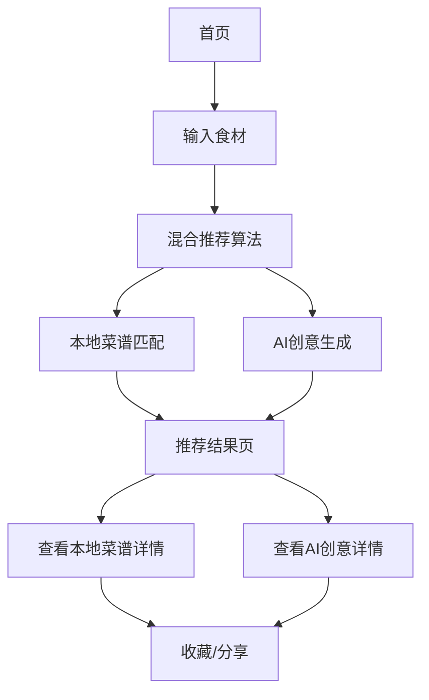

## 1. 产品概述
一个基于H5的智能菜谱推荐网站，用户输入家中现有食材，系统通过AI智能分析和已有菜谱库混合推荐可制作的菜谱。解决用户面对冰箱食材不知道做什么菜的日常困扰，提供便捷、实用的烹饪解决方案。

## 2. 核心功能

### 2.1 用户角色
无需用户注册，所有用户均可免费使用基础功能。

### 2.2 功能模块
网站包含以下核心页面：
1. **首页**：食材输入、热门菜谱展示、AI推荐演示、使用引导
2. **推荐结果页**：混合推荐结果（本地菜谱+AI创意）、AI创意专区、详细步骤、营养信息

### 2.3 页面详情
| 页面名称 | 模块名称 | 功能描述 |
|---------|---------|----------|
| 首页 | 食材输入区 | 支持文本输入和语音输入，智能识别食材名称，提供食材建议补全 |
| 首页 | AI推荐演示 | 展示AI创意推荐能力，提供示例食材组合的智能推荐 |
| 首页 | 热门推荐 | 展示当前季节热门菜谱，无需输入即可浏览 |
| 首页 | 使用引导 | 简洁的图文说明，指导用户如何使用 |
| 推荐结果页 | 混合推荐列表 | 优先显示本地菜谱库匹配结果，同时展示AI创意推荐，标识推荐来源 |
| 推荐结果页 | AI创意专区 | 专门展示AI根据食材特性生成的创意搭配和新颖菜谱 |
| 推荐结果页 | 菜谱详情 | 展示完整制作步骤、所需时间、难度等级、营养成分 |
| 推荐结果页 | 收藏分享 | 支持收藏喜欢的菜谱，分享到社交媒体 |

## 3. 核心流程
用户操作流程：
1. 用户进入首页，输入或语音录入现有食材
2. 系统启动混合推荐：优先匹配本地菜谱库，同时调用AI服务生成创意推荐
3. 用户浏览推荐结果，可筛选查看本地菜谱或AI创意推荐
4. 用户选择感兴趣的菜谱查看详情，可收藏或分享

## 4. 用户界面设计

### 4.1 设计风格
- **主色调**：温暖橙色(#FF6B35)搭配清新绿色(#4CAF50)，营造美食温馨感
- **按钮样式**：圆角矩形设计，悬停有轻微阴影效果
- **字体**：中文使用思源黑体，数字使用Roboto，主要文字16px，标题24-32px
- **布局风格**：卡片式布局，清晰分区，移动端优先
- **图标风格**：使用圆润的线性图标，符合美食主题

### 4.2 页面设计概览
| 页面名称 | 模块名称 | UI元素 |
|---------|---------|--------|
| 首页 | 食材输入区 | 顶部搜索框，语音输入按钮在右侧，下方显示已添加的食材标签 |
| 首页 | AI推荐演示 | 轮播展示AI推荐案例，包含"AI推荐"标识 |
| 首页 | 热门推荐 | 横向滑动的卡片，每张卡片包含菜品图片、名称、制作时间 |
| 推荐结果页 | 混合推荐列表 | 垂直列表，每行显示菜品缩略图、名称、匹配度、推荐来源标识(本地/AI) |
| 推荐结果页 | AI创意专区 | 特殊卡片样式，突出显示AI创意标识和新颖度评分 |
| 推荐结果页 | 菜谱详情 | 大图展示，步骤分开展示，包含计时器功能和营养标签 |

### 4.3 响应式设计
采用移动端优先设计，完美适配各种手机屏幕。支持触摸滑动操作，按钮大小适合手指点击。在平板和桌面端保持一致的视觉体验。