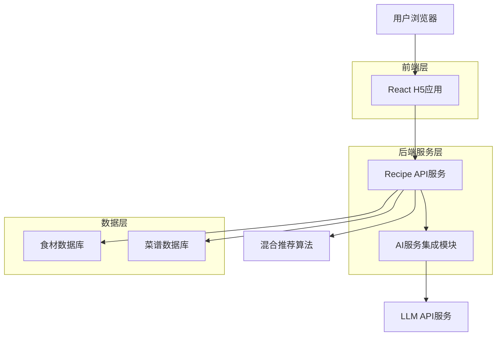
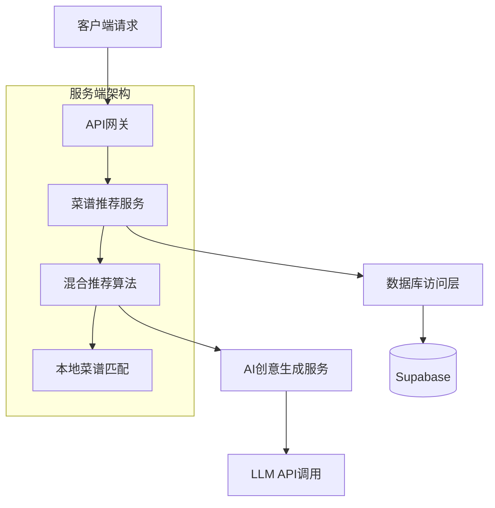
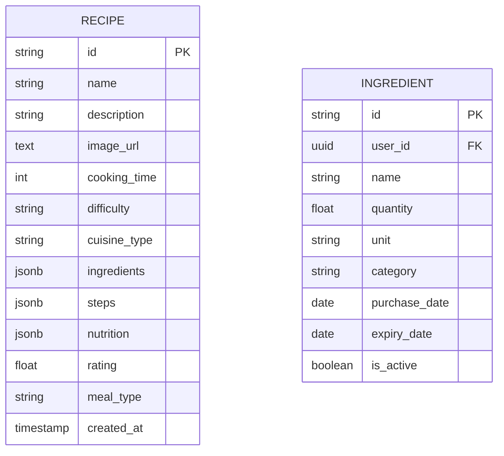

## 1. 架构设计



## 2. 技术描述

- **前端**: React@18 + TailwindCSS@3 + Vite
- **初始化工具**: vite-init
- **后端**: Node.js@18 + Express@4
- **数据库**: Supabase (PostgreSQL)
- **AI服务**: Vercel AI SDK + LLM API服务

## 3. 路由定义

| 路由 | 用途 |
|-------|---------|
| / | 首页，食材输入和热门推荐 |
| /recipes | 推荐结果页，展示匹配的菜谱列表 |
| /recipe/:id | 菜谱详情页，显示制作步骤和详细信息 |

## 4. API定义

### 4.1 核心API

**获取推荐菜谱**
```
POST /api/recipes/recommend
```

请求参数:
| 参数名 | 参数类型 | 是否必需 | 描述 |
|-----------|-------------|-------------|-------------|
| ingredients | array | true | 食材名称数组 |
| cuisine_type | string | false | 菜系偏好 |
| difficulty | string | false | 难度等级 |
| ai_creative | boolean | false | 是否启用AI创意推荐 |

响应:
| 参数名 | 参数类型 | 描述 |
|-----------|-------------|-------------|
| local_recipes | array | 本地菜谱匹配结果 |
| ai_recipes | array | AI创意推荐结果 |
| match_scores | object | 各推荐结果匹配度分数 |
| ai_creativity_score | number | AI创意新颖度评分 |

示例:
```json
{
  "ingredients": ["鸡肉", "土豆", "洋葱"],
  "cuisine_type": "中式",
  "difficulty": "简单"
}
```

**获取AI创意菜谱**
```
POST /api/recipes/ai-creative
```

请求参数:
| 参数名 | 参数类型 | 是否必需 | 描述 |
|-----------|-------------|-------------|-------------|
| ingredients | array | true | 食材名称数组 |
| creativity_level | string | false | 创意程度 (保守/平衡/创新) |

响应:
| 参数名 | 参数类型 | 描述 |
|-----------|-------------|-------------|
| ai_recipes | array | AI生成的创意菜谱 |
| creativity_explanation | string | 创意说明和食材搭配原理 |
| estimated_success_rate | number | 预估成功率 |

**获取菜谱详情**
```
GET /api/recipes/:id
```

响应:
| 参数名 | 参数类型 | 描述 |
|-----------|-------------|-------------|
| id | string | 菜谱ID |
| name | string | 菜谱名称 |
| ingredients | array | 所需食材 |
| steps | array | 制作步骤 |
| nutrition | object | 营养信息 |
| recipe_source | string | 菜谱来源 (本地/AI生成) |
| ai_explanation | string | AI生成菜谱时的创意说明 |

## 5. 服务器架构图



## 6. 数据模型

### 6.1 数据模型定义 (Existing Schema Adapted)



### 6.2 数据定义语言

**菜谱表 (recipes)**
```sql
CREATE TABLE recipes (
    id UUID PRIMARY KEY DEFAULT gen_random_uuid(),
    name VARCHAR(255) NOT NULL,
    description TEXT,
    image_url TEXT,
    cooking_time INTEGER DEFAULT 0,
    difficulty VARCHAR(20),
    cuisine_type VARCHAR(50), -- Added via migration
    ingredients JSONB DEFAULT '[]'::jsonb,
    steps JSONB DEFAULT '[]'::jsonb,
    nutrition JSONB DEFAULT '{}'::jsonb,
    rating DECIMAL(3,2) DEFAULT 0.00,
    meal_type VARCHAR(50),
    created_at TIMESTAMP WITH TIME ZONE DEFAULT NOW()
);
```
